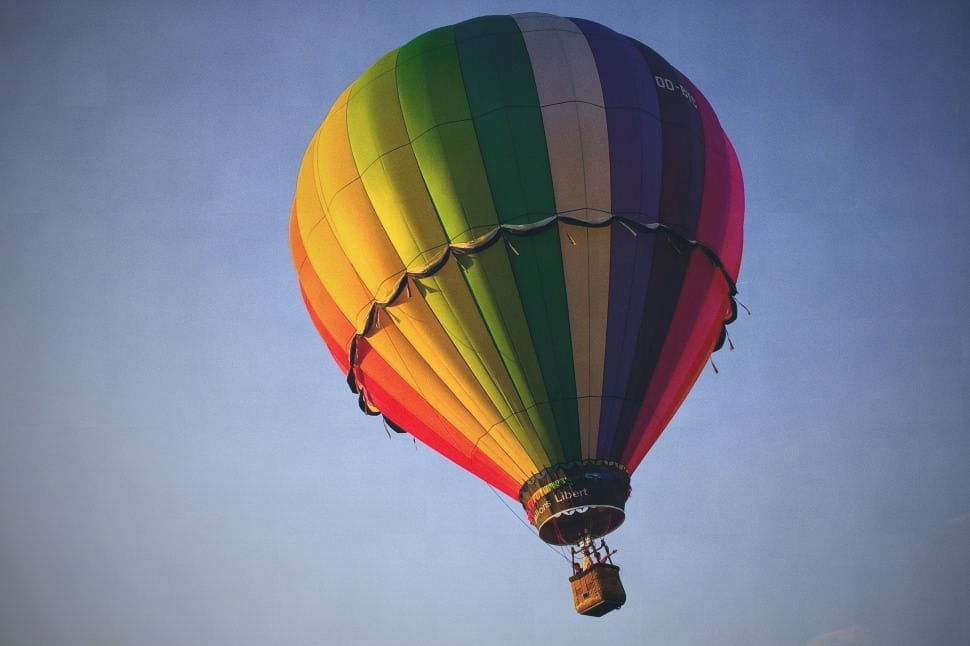

# Film Simulation

Transform your digital photos with authentic film simulation profiles, emulating the look of popular film stocks.

**Available Implementations:**
- 🐍 **Python (Original)** - Desktop batch processing
- 📱 **Android App** - Mobile app with GPU acceleration → [See android-app/](android-app/)

This repository contains both a Python script for desktop batch processing and a native Android application.

## Python Script Features

- Apply multiple film profiles to a single image
- Adjustable color curves, contrast, saturation, chromatic aberration, and blur
- Film grain simulation
- Color temperature adjustment
- Cross-processing effect
- Optional parallel processing for improved performance
- Custom film profiles via JSON configuration

## 📱 Android App (NEW!)

A modern Android application with GPU-accelerated processing:

- **12 Film Profiles** - Kodak Portra, Fuji Velvia, and more
- **Real-time Preview** - GPU-accelerated OpenGL ES filters
- **Material 3 Design** - Dynamic color, dark mode support
- **Clean Architecture** - MVVM, Hilt DI, Kotlin Coroutines
- **Status:** Phase 1-2 Complete (Foundation ready)

**Get Started:** [android-app/README.md](android-app/README.md) | [Implementation Tracker](IMPLEMENTATION_TRACKER.md)

---

## Python Version

## Examples

### Original Image


Original Image [Source](https://www.peakpx.com/593470/rainbow-color-hot-air-balloon)

### Film Simulations

| Fuji Velvia 50                  | Kodak Portra 400                  | Fuji Superia 400                    |
|-------------------------------------|-----------------------------------|-------------------------------------|
|     |  |  |

| Ilford HP5 Plus                 | Kodak Ektar 100                   | Kodak Tri-X 400                       |
|-------------------------------------|-----------------------------------|-------------------------------------|
|  |  |  |

| Fuji Pro 400H                  | Fuji Provia 100F                  | Kodak Gold 200                    |
|-------------------------------------|-----------------------------------|-------------------------------------|
|     |  |  |

| CineStill 800T                 | Kodak Ektachrome E100                   | Lomography Color Negative 400                       |
|-------------------------------------|-----------------------------------|-------------------------------------|
|  |  |  |

## Requirements

- Python 3.6+
- Required Python packages:
  - numpy
  - Pillow
  - colour-science
  - psutil
  - scipy
  - piexif

You can install the required packages using pip:

```
pip install numpy Pillow colour-science psutil scipy piexif
```

## Usage

Basic usage:

```
python film_simulation.py input_image.jpg --profiles film_profiles.json
```

With parallel processing:

```
python film_simulation.py input_image.jpg --profiles film_profiles.json --parallel
```

### Command-line Arguments

- `input_image`: Path to the input image (required)
- `--profiles`: Path to JSON file containing film profiles (required)
- `--chroma`: Override chromatic aberration strength
- `--blur`: Override blur amount
- `--color_temp`: Color temperature (default: 6500K)
- `--cross_process`: Apply cross-processing effect
- `--parallel`: Enable parallel processing

### Examples

1. Process an image with default settings:
   ```
   python film_simulation.py my_photo.jpg --profiles default_profiles.json
   ```

2. Process an image with parallel processing and custom color temperature:
   ```
   python film_simulation.py my_photo.jpg --profiles custom_profiles.json --parallel --color_temp 5500
   ```

3. Apply cross-processing effect:
   ```
   python film_simulation.py my_photo.jpg --profiles film_profiles.json --cross_process
   ```

## Custom Film Profiles

You can create custom film profiles by modifying the JSON file. Here's an example structure:

```json
{
  "My Custom Film": {
    "color_curves": {
      "R": {"x": [0, 0.25, 0.5, 0.75, 1], "y": [0, 0.27, 0.53, 0.77, 1]},
      "G": {"x": [0, 0.25, 0.5, 0.75, 1], "y": [0, 0.25, 0.5, 0.75, 1]},
      "B": {"x": [0, 0.25, 0.5, 0.75, 1], "y": [0, 0.23, 0.47, 0.73, 1]}
    },
    "contrast": 1.1,
    "saturation": 0.9,
    "chromatic_aberration": 0.2,
    "blur": 0.1,
    "base_color": [255, 250, 245],
    "grain_amount": 0.03,
    "grain_size": 1
  }
}
```

You can include multiple film profiles in a single JSON file.

## Output

The script will generate one output image for each film profile in the JSON file. Output images will be saved in the same directory as the input image, with the film profile name appended to the original filename.

## License

[MIT License](https://opensource.org/licenses/MIT)

## Contributing

Contributions, issues, and feature requests are welcome. Feel free to check [issues page](https://github.com/yourusername/film-simulation/issues) if you want to contribute.

## Author

[Sinan Onur Altınuç]

